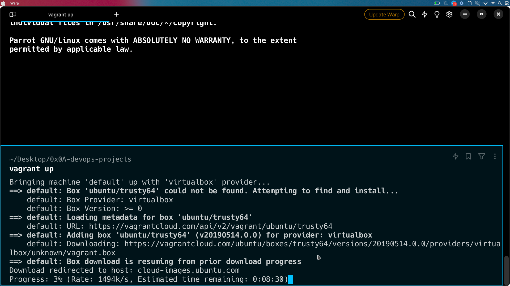
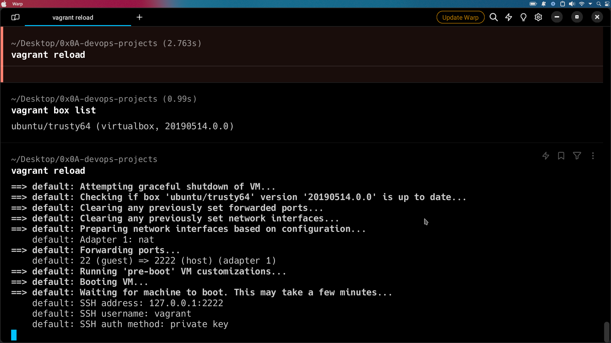
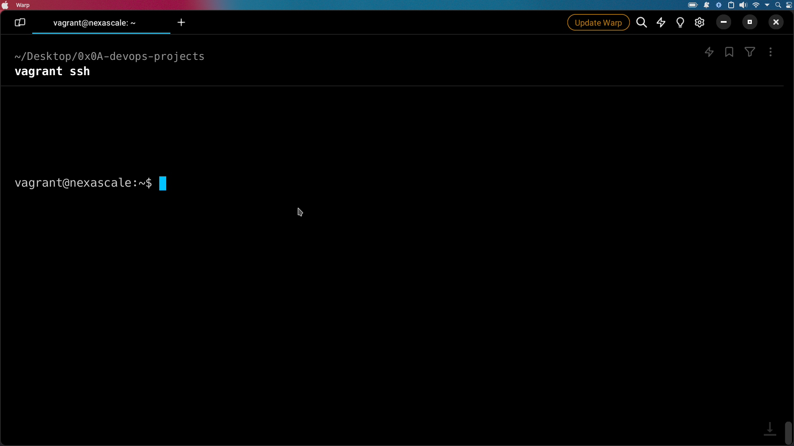
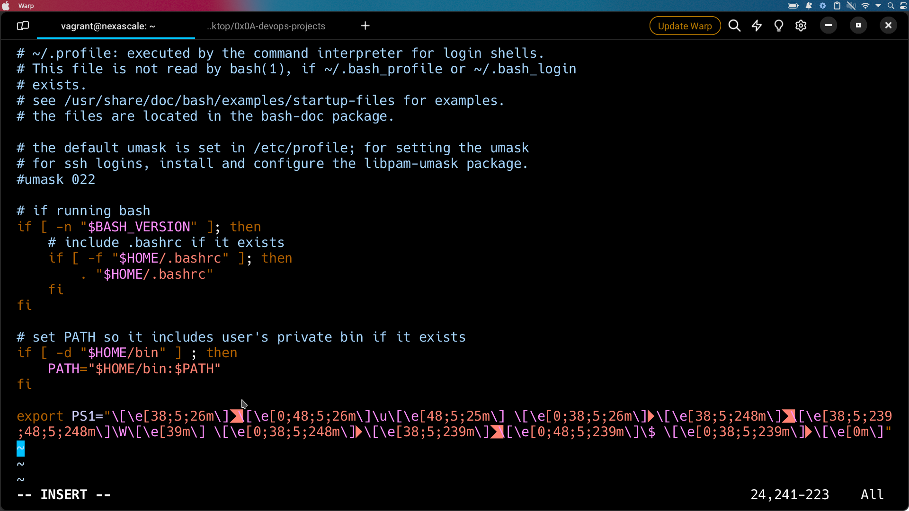
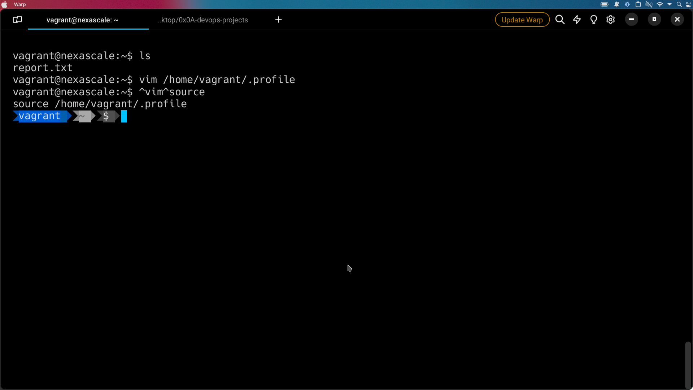
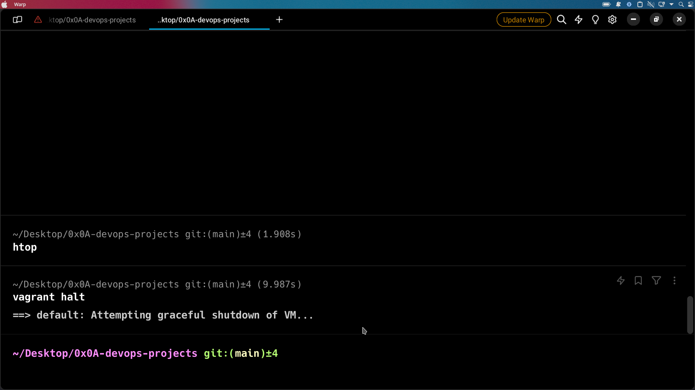
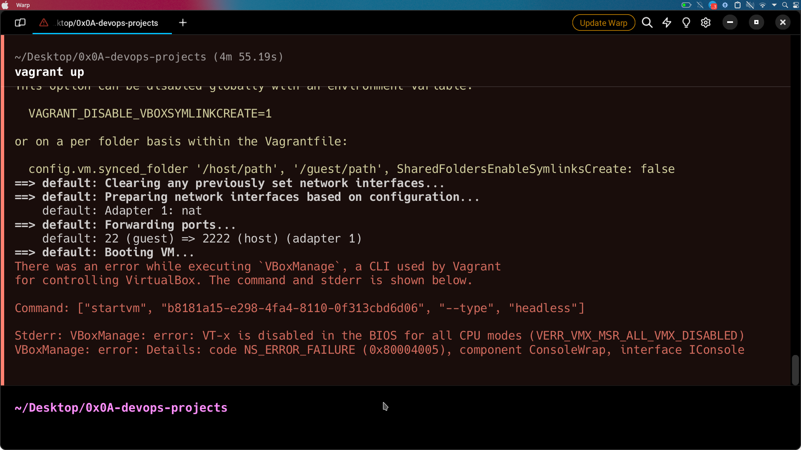

# Setting up an Ubuntu Virtual Machine using vagrant

The ultimate joy of a developer is seeing applications they buit work equally well and correctly regardless of the device, operating system, architecture of the platform, version or development stage of the application. In the realm of DevOps, where development and operations teams collaborate closely to ensure smooth application delivery, the need for consistent and reproducible environments becomes paramount. This gives rise to the concept of **virtual machines**. Vagrant gives us a way to do just that.

> Vagrant enables the creation and configuration of lightweight, reproducible, and portable development environments.

## Initial Idea

The goal of this project was to create an Ubuntu VM using vagrant.

## Steps Followed

- Initially, I needed to have Vagrant installed on my system. A brief look at the official [docs](https://developer.hashicorp.com/vagrant/install) proved to be very helpful. Once Vagrant was installed, I was all set to dive in. Hashi products are ussualy very well documented, after reviewing it for a few hours, it was time to get typing. 

- Next thing on the list was adding the box and configuring its properties in the Vagrantfile. 
    > Vagrant file is used  to describe the type of machine required for a project, and how to configure and provision these machines.

- With the box added, it was time to fire it up, `vagrant up` command did the trick this time.

- If changes have been made to the vagrant file, you can run `vagrant reload` to run the box with the new configs. 

- To use the machine I just spun up, I had to ssh into it. There was really no extra tooling and configuration  needed to configure ssh keys in this case. The initiall command `vagrant up` (running it for the first time) already took care of that. By default, Vagrant generates an insecure private key, which is placed in the `.vagrant` directory of your Vagrant environment. This private key is used for SSH authentication between the host and the guest VM. This is convenient for getting started quickly, but is not recommended for production use. 

Vagrant sets up SSH forwarding between the host and guest, which allows you to connect to the guest VM from your host using `vagrant ssh`. This is done by setting up forwarded ports and handling the authentication transparently.

- Having logged in to the box, it was time to do something with it, since there was no actual workdload to be done, I ended up modifying the primary prompt string ([PS1](https://www.warp.dev/blog/whats-so-special-about-ps1)) for the box by editing the users `~/.profile` file.

which resulted to this nice looking prompt after editing. 

- Finally to close it off, `vagrant halt` command logged us off. 

## Challenges 

I encoutered some challenges when setting starting the box initially, my host had virutalization vtx disabled in the BIOS, which caused it to scream this nasty error. 

Rebooting to BIOS and enabling virutalization and restarting fixed the error. 

You can checkout the custom box [here](https://app.vagrantup.com/akhonyaebenezer/boxes/nexascale/versions/0.0.1)

